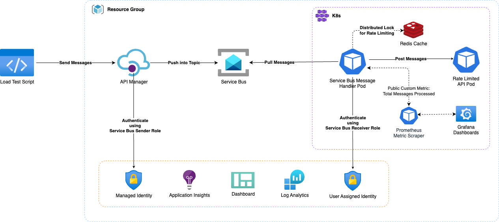
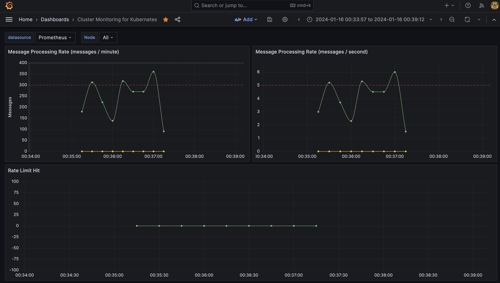

# Rate Limiting Sample - Integration of Azure API Management (APIM) with Azure Service Bus for Rate-Limited Message Processing

The objective is to establish a reliable and efficient integration between Azure API Management (APIM) and Service Bus for processing messages in a rate-limited manner. The integration aims to leverage APIM policies for authentication, authorization, and message transformation before forwarding messages to the Service Bus. Processing these messages by a rate-limited service dependency is intended to mimic the the control the resources your system could consume, imposing limits on the rate at which other applications or services can access them.

> 💡 This is an implementation of the [Rate Limiting pattern](https://learn.microsoft.com/azure/architecture/patterns/rate-limiting-pattern) described in the Azure Architecture Center.



## Integrating Azure API Management (APIM) and Azure Service Bus

This sample involves configuring APIM to use Service Bus as the backend. Messages sent to the Service Bus are processed by a mock service which posts to a rate limited API. Load testing of this configuration involved sending approximately ~4.6K messages to APIM in 1 minute (~77 requests/second). APIM posted these messages to the Service Bus using Managed Identity with the Service Bus Sender role.

Using **3 job processors** to read the records from the queue at a controlled rate of **45 messages per batch** with **30 seconds lease**, the messages are processed within the Rate Limited API's limits, **300 messages per minute**.



The integration utilizes APIM policies for authentication, authorization, and message transformation. The policies include obtaining credentials using Managed Identity, setting the authorization header, specifying the content type in the request header, and optionally attaching metadata to the message. The message payload is set as the body of the message, and its content can be modified if necessary.

### Rate Limiting

There is a very basic `Rate Meter` implementation to track the number of messages processed per minute or per second. Every time a message is processed, `totalMessagesCounter.increment();` is called using [Spring Actuator](https://docs.spring.io/spring-boot/docs/current/reference/html/actuator.html). [Prometheus](https://prometheus.io/) scraper collects these metrics and [Grafana](https://grafana.com/) dashboard visualizes the metrics.  

Messages per minute is visualized using using the following query:

```bash
sum(rate(total_messages_processed_total[1m])*60)
```

Also, we are collecting metrics from the rate limited API response if rate limit hit. This metrics is visualized using the following query:

```bash
avg(rate(rate_limit_hits_total[1m])*60)
```

#### Rate Limiting Implementation

This is achieved by implementing a [Distributed Lock](https://redis.io/topics/distlock) using [Redis](https://redis.io/) and [Spring Integration](https://spring.io/projects/spring-integration). The lock is acquired before processing any messages for `30 seconds` and released after the processing is complete. In each lease, only `45 messages` are pulled in to process from Service Bus. Also, there are `3 keys` created to mimic `3 partitions` to adhere `300 messages per minute` rate for `3 instances` of the message handler service. This ensures that only one handler service processes the messages within the `30 seconds lease` time and limiting the rate at which messages are processed to `~1.5 messages per second`. The lease time can be adjusted to increase or decrease the messages per second rate.

Using the following two parameters in message handler service, we can control the rate at which messages are processed:

```bash
private static final int MAX_MESSAGE_COUNT = 45;
private static final int LEASE_TIME_IN_SECONDS = 30;
```

This approximates to `~1.5 messages per second` per instance. When 3 instances of the message handler service runs, we see approximately `~4.5 messages per second` processed. This is how `~300 messages per minute` is achieved.

#### Exceeding Rate Limits

If the rate-limited service cannot keep up with the incoming message rate, message handler service only processes a subset of messages and the rejected messages will be abandoned. Abandoned messages are sent to the handler service again in the next session by Service Bus. This ensures that the service is not overwhelmed, and it prevents potential degradation of performance or service disruption. Also, service bus durability ensures that the messages are not lost. Abandoned messages are retired 10 times (default) and then put in the dead letter queue.

> `~4.5 messages per seconds` with 3 instances could target `~270 messages per minute`. However, each instance refreshes the lease every `30 seconds` and each instance refreshes the session on Service Bus which takes around `~5 seconds` and only pulls `45 messages` in each session. These integration latencies contributed to the overall throughput. The actual throughput can be different, most probably lower but not higher in a production system.

### Performance

Load testing captured by Application Insights attached to APIM indicated that 100% of the messages were successfully sent to the Service Bus within approximately 1 minute. The latency metrics, as observed in Application Insights, showed a 95th percentile latency of 190ms and an average latency of 168ms.


The selected approach offers a straightforward integration between APIM and Service Bus, providing a buffering and retry mechanism without the need for complex application logic. The Service Bus effectively absorbs backpressure from the rate-limited API, allowing for smooth processing.

### Handling Backpressure

In this setup, backpressure handling refers to the ability of the system to manage and control the flow of messages when the downstream system, in this case, the rate-limited API, is not able to process messages at the rate they are being received.

Here's how backpressure is handled in this context:

**1. Service Bus Buffering and Retry Mechanism:** Service Bus, being a messaging service, inherently provides a buffering mechanism. When messages are sent from APIM to the Service Bus, they are stored in a queue. If the rate-limited service is temporarily unable to process messages at the rate they are arriving, the messages remain in the queue, creating a buffer. Service Bus also has a retry mechanism, attempting to send the messages to the processor sending to the rate-limited service again after a predefined interval if the processing initially fails.

**2. Rate Limiting at the Service Level:** The rate-limited service is designed to process messages at a specified rate, in this case, `300 messages per minute` according to the load testing findings. This rate limit acts as a form of backpressure. If the rate-limited service cannot keep up with the incoming message rate, it only processes a subset of messages, adhering to the defined rate. This ensures that the service is not overwhelmed, and it prevents potential degradation of performance or service disruption.

**3. APIM Policies for Flow Control:** APIM policies are used to implement authentication, authorization, and message transformation before sending messages to the Service Bus. These policies can also be used to control the flow of messages. For example, policies can be configured to introduce delays between consecutive requests to the Service Bus, providing a form of backpressure to avoid overwhelming the downstream system. Also, message transformation, event schema validation, and other operations can be performed to ensure that the messages are in the correct format before being sent to the Service Bus.

### Throughput

Throughput refers to the number of messages that can be successfully transmitted and processed within a given unit of time. It's a measure of the system's capacity to handle a certain volume of messages effectively. Throughput is a crucial performance metric that helps assess the efficiency and scalability of the integration.

Here's how throughput is relevant in this context:

**1. APIM to Service Bus Throughput:** This metric measures the rate at which messages are sent from APIM to the Service Bus. The throughput is influenced by the efficiency of APIM policies, the network latency between APIM and the Service Bus, and the capacity of the Service Bus to handle incoming messages. The higher the throughput, the more messages can be transmitted from APIM to the Service Bus within a specific time frame. SLAs provided by APIM and Service Bus shows that the throughput can be increased by scaling up the APIM instance and the Service Bus.

**APIM** basic tier has **99.95% SLA** and estimated maximum throughput per unit is **1,000 requests/sec**.  **Service Bus** standard tier has **99.9% SLA** and observed throughput was **4400 messages/second** per Messaging Unit (MU) with a 1 KB message size.

This combined throughput is up to **4,000 messages/second** by scaling up the APIM instances to 4 units and with a Standard, Single Service Bus Messaging Unit.

**2. Service Bus Processing Throughput:** Once messages are in the Service Bus, throughput also refers to the rate at which the Service Bus can process these messages. The processing capacity is determined by factors such as the performance of the processor, the rate-limited service, the rate limit imposed on the service, and the ability of the Service Bus to handle concurrent requests. A higher processing throughput means that the rate-limited service can efficiently handle a larger number of messages within the defined rate limit.

**Service Bus** supports **5,000 concurrent** receive requests on a queue, topic, or subscription entity. Subsequent receive requests are rejected, and an exception is received by the calling code. This quota applies to the combined number of concurrent receive operations across all subscriptions on a topic. This means that the Service Bus can process up to **5,000 messages concurrently**.

**3. Rate Limited API Processing Throughput:** Rate Limited API ensures consistent availability and performance by applying some limits to how APIs are used. API limits are evaluated within a 1 minute (60 second) sliding window in current configuration.

**4.End-to-End Throughput:** The overall throughput of the entire integration is a combination of the throughput of APIM to Service Bus transmission and the throughput of Service Bus message processing. It represents the system's ability to handle a specific volume of messages from the point of entry (APIM) to the point of processing (Rate Limited API).

Although the throughput of APIM to Service Bus transmission is higher than the throughput of Service Bus message processing, the overall throughput is limited by the Rate Limited API throughput. While we can send up to **4,000 messages/second** from APIM to Service Bus, Rate Limited API can only process up to **1.5K messages/5 minutes**. This means that the overall throughput of the integration is limited to **~5 messages/second** with a rate limit of **300 messages per minute**.

> The actual numbers in a production environment can be different, most probably lower but not higher.

### Summary

This architecture provides a very high throughput system that can scale up to the limits of the Rate Limited API without complex application logic. It also provides a reliable integration between APIM and Service Bus, with a buffering and retry mechanism that ensures that messages are not lost. Out of ~4.6K messages with no messages in the dead letter queue. The rate limiting implementation ensures that the Rate Limited API is not overwhelmed, preventing potential degradation of performance or service disruption. The Service Bus also provides a form of durability, absorbing the abandoned messages rejected from the Rate Limited API and preventing it them being lost.

### References

- [Policy expressions in Azure API Management](https://docs.microsoft.com/en-us/azure/api-management/api-management-policy-expressions)
- [APIM Pricing SLAs](https://azure.microsoft.com/en-gb/pricing/details/api-management/)
- [Service Bus SLA](https://www.azure.cn/en-us/support/sla/service-bus/)
- [Service Bus Benchmark](https://techcommunity.microsoft.com/t5/messaging-on-azure-blog/premium-messaging-how-fast-is-it/ba-p/370722)
- [Service Bus Performance Best Practices](https://learn.microsoft.com/en-us/azure/service-bus-messaging/service-bus-performance-improvements?tabs=net-standard-sdk-2)

## Infrastructure Provisioning

Following steps are required to run the sample on Azure.

Infrastructure components used for this POC are:

1. API Management (Consumption Plan)
2. Service Bus (Standard)
3. Azure Kubernetes Service (AKS) (Standard)

To provision the infrastructure, you need to have [Azure CLI](https://docs.microsoft.com/en-us/cli/azure/install-azure-cli?view=azure-cli-latest) installed.
Using [Azure CLI](https://docs.microsoft.com/en-us/cli/azure/install-azure-cli?view=azure-cli-latest), you will need to install [Bicep](https://learn.microsoft.com/en-us/azure/azure-resource-manager/bicep/overview?tabs=bicep) which is a domain-specific language (DSL) that uses declarative syntax to deploy Azure resources.

### Install Bicep

Run the following command to ensure you have the latest version of Bicep:

```bash
az bicep install && az bicep upgrade
```

### Set Defaults

Run the following command to set the defaults. Throughout the setup, we will use these defaults and passing them as parameters to different components:

```bash
export LOCATION=uksouth
export RESOURCE_GROUP_NAME=rate-limiting-sample-rg
export TOPIC_NAME=rate-limiting-sample-fifo-topic
export TOPIC_SUBSCRIPTION_NAME=rate-limiting-sample-fifo-topic-subs
az configure --defaults location=$LOCATION group=$RESOURCE_GROUP_NAME
```

### Deploy the template to Azure

Run the following command to deploy the Bicep template to Azure. The command can take a minute or two to complete, and then you'll see a successful deployment.

```bash
make provision
```

To see the deployment details:

```bash
az deployment group list --output table --resource-group $RESOURCE_GROUP_NAME
```

### Clean up deployment

Run the following command to remove the resource group and all resources associated with it.

```bash
az group delete --resource-group $RESOURCE_GROUP_NAME
```

### Running Local

**Before you run in your local, complete steps in [Infrastructure Provisioning](#infrastructure-provisioning) section.**

You need [Minikube](https://minikube.sigs.k8s.io/docs/start/) and [Skaffold](https://skaffold.dev/) installed in your environment for local development. You also need [Helm](https://helm.sh/docs/intro/install/) installed to install [Redis](https://redis.io/) in your local cluster. Redis is used as a distributed lock provider for the message handlers.

**Step 1: Creating Local Cluster:**

Create a new [minikube](https://minikube.sigs.k8s.io/docs/start/) cluster:

```bash
make setup-local-cluster
```

**Step 2: Setting up Azure Service Bus Connection:**

Assuming you have provisioned the resources in previous steps on [Infrastructure Provisioning](#infrastructure-provisioning) section, you need to create a new `.env` file and save it in the root directory of the project. The `.env` file should contain the following environment variables:

```bash
SERVICE_BUS_CONNECTION_STRING=<your-service-bus-connection-string>
SERVICE_BUS_TOPIC_NAME=<your-service-bus-topic-name>
SERVICE_BUS_SUBSCRIPTION_NAME=<your-service-bus-subscription-name>
```

To generate the connection string, you can use the following command:

```bash
make setup-local-env
```

**Step 3: Deploying Secrets:**

Run the following command to create a generic secret in the cluster:

```bash
make setup-local-cluster-secret
```

**Step 4: Deploying Services:**

Run the following command to deploy the services to your cluster using [Skaffold](https://skaffold.dev/):

```bash
make deploy-local-cluster
```

By convention, `message handler service` will use `rate-limiting-api:8081` as the local address for the rate limiting API inside the cluster. This address is set in the environment variables for the service.

**Step 5: Running Load Test:**

Run the following command to run the load test. This will generate ~15.5K messages and send them to the service bus via APIM. `message handler service` will listen to these messages and post to `rate limiting api`.

During this test, we expect the service bus to receive all the messages. However, `rate limiting api` will only receive **~80 messages per minute**. This rate limit is set in the `rate limiting api` and can be changed by updating the `application.yaml` file in the `rate limiting api` project.

```bash
make load-test-local
```

### Playbooks

#### Local Redis Instance

Redis can be accessed via port 6379 on the following DNS name from within your cluster:

```bash
redis-master.default.svc.cluster.local
```

To get your password run:

```bash
export REDIS_PASSWORD=$(kubectl get secret --namespace default redis -o jsonpath="{.data.redis-password}" | base64 -d)
```

To connect to your Redis server:

**Run a Redis pod that you can use as a client**:

```bash
kubectl run --namespace default redis-client --restart='Never'  --env REDIS_PASSWORD=$REDIS_PASSWORD  --image docker.io/bitnami/redis:7.2.3-debian-11-r1 --command -- sleep infinity
```

Use the following command to attach to the pod:

```bash
kubectl exec --tty -i redis-client \
--namespace default -- bash
```

**Connect using the Redis CLI**:

```bash
REDISCLI_AUTH="$REDIS_PASSWORD" redis-cli -h redis-master
```

To connect to your database from outside the cluster execute the following commands:

```bash
kubectl port-forward --namespace default svc/redis-master 6379:6379 &
REDISCLI_AUTH="$REDIS_PASSWORD" redis-cli -h 127.0.0.1 -p 6379
```

### Local Prometheus Instance

Watch the Prometheus Operator Deployment status using the command:

```bash
kubectl get deploy -w --namespace default -l app.kubernetes.io/name=kube-prometheus-operator,app.kubernetes.io/instance=prometheus
```

Watch the Prometheus StatefulSet status using the command:

```bash
kubectl get sts -w --namespace default -l app.kubernetes.io/name=kube-prometheus-prometheus,app.kubernetes.io/instance=prometheus
```

Prometheus can be accessed via port "9090" on the following DNS name from within your cluster:

```bash
prometheus-kube-prometheus-prometheus.default.svc.cluster.local
```

To access Prometheus from outside the cluster execute the following commands:

```bash
echo "Prometheus URL: http://127.0.0.1:9090/"
kubectl port-forward --namespace default svc/prometheus-kube-prometheus-prometheus 9090:9090
```

Watch the Alertmanager StatefulSet status using the command:

```bash
kubectl get sts -w --namespace default -l app.kubernetes.io/name=kube-prometheus-alertmanager,app.kubernetes.io/instance=prometheus
```

Alertmanager can be accessed via port "9093" on the following DNS name from within your cluster:

```bash
prometheus-kube-prometheus-alertmanager.default.svc.cluster.local
```

To access Alertmanager from outside the cluster execute the following commands:

```bash
echo "Alertmanager URL: http://127.0.0.1:9093/"
kubectl port-forward --namespace default svc/prometheus-kube-prometheus-alertmanager 9093:9093
```

### Local Grafana Instance

Get the application URL by running these commands:

```bash
echo "Browse to <http://127.0.0.1:8080>"
kubectl port-forward svc/grafana 8080:3000 &
```

Get the admin credentials:

```bash
echo "User: admin"
echo "Password: $(kubectl get secret grafana-admin --namespace default -o jsonpath="{.data.GF_SECURITY_ADMIN_PASSWORD}" | base64 -d)"
```
